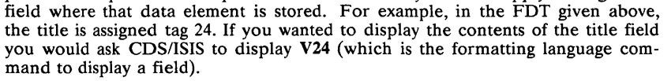

# WinISIS Datenbankexport

Extract Data from broken BIBLIO database. 


## Failed Ideas

[https://github.com/scieloorg/ioisis](https://github.com/scieloorg/ioisis)

ioisis looks promising as it states that it can handle broken and corrupt MST files and convert them into csv or json format. Problem is: 

- without the `ignore erros` option, the program crashes
- with the `ignore erros` option, the program endlessly reads byte for byte, but never detects the end of a record….

In `[mst.py](http://mst.py)` file in function `iter_con`

```python
def record_ibp_gen():
    nonlocal last_tell
    ibps = []
    while True:
        try:
            record = rec_or_end_struct.parse_stream(mst_stream)
        except SelectError: # every read raises a SelectError..
            if self.ibp == "check":
                raise # WIHTOUT ibp argument
            elif self.ibp == "store":
                ibps.append(mst_stream.read(control_record.modulus))
            continue # WITH ibp argument set to store / ignore reads in endlessly
        if ibps:
            yield {"ibp": b2a_hex(b"".join(ibps))}
            ibps.clear()
        if record is None:  # No more records
            break
        last_tell = mst_stream.tell()
        yield record

if yield_control_record:
    prev = control_record
else:
    prev = None
for record in record_ibp_gen():
    if record and "ibp" in record:
        prev.update(record)
        yield prev
        prev = None
    else:
        if prev:
            yield prev
        prev = record
if prev:
    yield prev
```

### Exporting via WINISIS

CLEAN VGA.MST

```python
Format VOLL
Field Seperator: |
Record Seperator >
Ouput line Length: 0
```

Results in error at 4972... WISIS caused a General Protection Fault in module WISIS.EXE

Broken IDs:  4972, 4977, 4995, 12622, 12632, 12633, 13546, 13547, 15264, 16000, 16004, 16005, 16006, 16012, 16016, 16661, 16694, 16701, 16745

<aside>
⚠️ Export should never include broken entries as it will crash

</aside>

CLEAN VTHES.MST

```python
Format VTHES
Field Seperator: |
Record Seperator >
Ouput line Length: 0
```

```python
Format: ALL
Field Seperator: |
Record Seperator >
Ouput line Length: 0
```

Both worked for all entries. 

BIBLIO 

## Bruma

Using Bruma, A CDS/Isis master manipulation library.

[https://github.com/scieloorg/Bruma](https://github.com/scieloorg/Bruma)

## Other Ideas

The PFT files are used for formatting the data in the WINISIS database viewer. The standard formatter is BIBLIO.PFT, which points to RAK.PFT. 

- BIBLIO.PFT (RAK.PFT)
    
    ```python
    v70,'-'f(mfn,1,0)/mhl, if v70*0.1='A' then v301^a": ",v201^n" ",v201^a,(| = |v21
    1^n| |,| = |n211^n,v211^a)," : "d251,(| ; |+v251^a)," / "d305,(| ; |+v305^a,| (|
    v305^b|)|),". // In: "d201^a if v70*0.2='AM' then v202^n" ",v202^a," / "v306^a,"
     ("v306^b")" if p(v442^a) and a(v204^a) then " ; "v490^a fi ". - "v262^a,". - "d
    442,(v402^a,| : |v402^b,|, |v442^a),". - ("d203^a,(v203^n" ",v203^a," / "v313^a,
    " ; "v203^b),")"d203^a,". - ("d204^a,(v204^n" ",v204^a," / "v314^a," ; "v204^b),
    ")"d204^a,". - ISBN "v100^a,". - S. "d490^d,(|; S. |+v490^d) fi if v70*0.2='AS' 
    then v204^n" ",v204^a," / "v314^a,". - ISSN "v101^a,". - "d490,(v490^a,|(|v490^c
    |), |,v490^b|, |,|S. |v490^d+|; |) fi fi if v70*0.1='M' then v302^a": ",v202^n" 
    ",v202^a,(| = |d212,v212^n| |,v212^a)," : "d252,(| ; |+v252^a) if p(v306) or p(v
    312) or p(v316) then ' / ' fi (| ; |+v306^a,| (|v306^b|)|) if p(v306) then " ; "
    d312 fi (| ; |+v312^a) if p(v306) or p(v312) then " ; "d316 fi (| ; |+v316^a),".
     - "d262,(|; |+v262^a),". - "d442,(v402^a,| : |v402^b,|, |v442^a),". - "d462,(v4
    62^a,| : |v462^b,| : |v462^d),". - ISBN "v100^a,". - ("d203,(v203^n" ",v203^a," 
    / "v303^a," / "v313^a," ; "v203^b),")"d203,". - ("d204,(v204^n" ",v204^a," / "v3
    14^a," ; "v204^b),")"d204,". - "v302^c fi if v70*0.2='Sp' then "    "v124^a,"  ™
    ZDB-Fachgruppe"d124^b(| |v124^b)%/if p(v314) then !/-1/ fi v314^a if p(v314^a) t
    hen ' : ' fi "["v314^b"]" if p(v314) then !/-0/%/ fi v204^n" ",!/-1/,v204^a,!/-0
    /,d214(| = |v214^n| |,| = |n214^n,v214^a)," / "d318,(| ; |+v318^a)," : "d254(| ;
     |+v254^a),'.',%/d404,v404^a," : "v404^b,"  "v444^a,(%/,v88^b| ---> |,v88^a%/),%
    /d101,"ISSN "v101^a fi%##(c5,v810^b| ...... |,v810^d,| : |v810^a%/)%#
    ```
    

The syntax is not clear to me, but interesting are elements that start with “v” and have a number afterwards. This references a field of an entry. If you look into the corresponding Field Defintion Table (FDT), you can map these columns to the name: 

- BIBLIO.FDT
    
    ```python
    W:BIBLIOM     AM    AS    S     K     P     V     E     BIBLI 
    F:BIBLIORAK   TITEL INVENTNEU   PRFLEVCHKALLRAK3  FINDVGCHK094
    F:CHK093CHK092CHK091CHK0XXCHK080J     V30X  WALTERRI820 
    S:BIBLIOLEX12 MFN   PRAE  
    ***
    Datensatznummer(MFN)-Transfer                     1 6 2 0
    Urheber Datensatz (INSTITUT)  abclm               20 200 0 1
    Datensatzeingabe (DATUM)                          22 8 2 0
    Urheber Datensatz (PERSON)    ab                  23 80 0 1
    Sprache Datensatz (CODE)      ab                  31 20 0 1
    Sprache Dokument (CODE)       ab                  40 20 0 1
    Datentr„ger (CODE)            ab                  50 20 0 1
    Literaturtyp/Code             ab                  60 20 0 1
    Datensatzkennung (CODE)                           70 3 1 0
    šbergeordnetes Bezugswerk     abcm                87 400 0 1
    Gleichgeordnetes Bezugswerk   abcm                88 400 0 1
    Untergeordnetes Bezugswerk    abcm                89 400 0 1
    ISBN                          abc                 100 40 0 0
    ISSN                          abc                 101 40 0 0
    ID-Nummern Artikel            ab                  121 40 0 1
    ID-Nummern Monographie        ab                  122 40 0 1
    ID-Nummern Begrenztes Gesamtwkab                  123 40 0 1
    ID-Nummern Fortsetzung        ab                  124 40 0 1
    Originaltitel Artikel         nal                 201 400 0 0
    Originaltitel Monographie     nal                 202 400 0 0
    Originaltitel Begrenztes GW   nabil               203 400 0 0
    Originaltitel Fortsetzung     nabl                204 400 0 0
    Paralleltitel Artikel         nal                 211 400 0 1
    Paralleltitel Monographie     nal                 212 400 0 1
    Paralleltitel Begrenztes GW   nal                 213 400 0 1
    Paralleltitel Fortsetzung     nal                 214 400 0 1
    Nebentitel Artikel            nab                 231 400 0 1
    Nebentitel Monographie        nab                 232 400 0 1
    Nebentitel Begrenztes GW      nab                 233 400 0 1
    Nebentitel Fortsetzung        nab                 234 400 0 1
    Titelzus„tze Artikel          abl                 251 400 0 1
    Titelzus„tze Monographie      abl                 252 400 0 1
    Titelzus„tze Begrenztes GW    abl                 253 400 0 1
    Titelzus„tze Fortsetzung      abl                 254 400 0 1
    Ausgabebezeichnung Monograph. a                   262 80 0 1
    Ausgabebezeichnung Begr.GW    a                   263 80 0 1
    Person in Personendatensatz   abcl                300 400 0 0
    1.Autor Artikel bei maximal 3 abm                 301 100 0 0
    1.Autor Monographie bei max. 3abm                 302 100 0 0
    1.Autor Begrenzt.GW bei max. 3abm                 303 100 0 0
    Alle sonstigen Autoren Artikelabm                 305 100 0 1
    Alle sonstigen Autoren Monogr.abm                 306 100 0 1
    Alle sonstigen Autoren Begr.GWabm                 307 100 0 1
    K”rperschaft in K”rp.Datensatzabm                 310 400 0 0
    Sortierwichtige K”rp.z.Monogr.abm                 312 400 0 0
    Sortierwichtige K”rp.z.Begr.GWabm                 313 400 0 0
    Sortierwichtige K”rp.z.Forts. abm                 314 400 0 0
    K”rperschaften Artikel        abm                 315 400 0 1
    Alle sonst.K”rp.z.Monographie abm                 316 400 0 1
    Alle sonst.K”rp.z.Begrenzt.GW abm                 317 400 0 1
    Alle sonst.K”rp.z.Fortsetzung abm                 318 400 0 1
    Kongreá in Kongreádatensatz   abcdm               320 400 0 0
    Kongreá zum Artikel           abcdm               321 400 0 0
    Kongreá zur Monographie       abcdm               322 400 0 0
    Kongreá zum Begrenten GW      abcdm               323 400 0 0
    Kongreá zur Fortsetzung       abcdm               324 400 0 0
    Verleger zur Monogr.: Ort/Nameabcdm               402 80 0 1
    Verleger zur Forts.: Ort/Name abcdm               404 80 0 1
    Erscheinungsjahr Monographie  ab                  442 40 0 0
    Erscheinungsjahr Begr.GW      ab                  443 40 0 0
    Erscheinungszeitraum Forts.   ab                  444 40 0 1
    Physische Beschreibung Monogr.abcd                462 160 0 0
    Physische Beschreibung Begr.GWabcd                463 160 0 0
    Physische Beschreibung Forts. abcdefgh            464 160 0 1
    Fundstelle Artikel            abcde               490 80 0 1
    Anmerkung (frei)              ab                  500 160 0 1
    Allgemeine Verweise           ab                  550 400 0 1
    Abstrakt (Kurzreferat)        abl                 600 800 0 1
    Notation/Klassifikation       ab                  610 40 0 1
    Schlagw”rter kontrolliert     abc                 620 160 0 1
    Schlagw”rter frei             abc                 621 160 0 1
    Geographische Erfassung       ab                  622 160 0 1
    Zeitangaben, Numerische Angab.ab                  623 160 0 1
    Formalangaben                 ab                  624 160 0 1
    Vorgeschlagene Schlagw”rter   ab                  625 160 0 1
    Lokale Schlagw”rter           ab                  626 160 0 1
    Schlagw”rter mit Syntax       abc                 630 160 0 1
    Exemplaranzahl                                    800 2 2 0
    Verknpfung zum Exemplar      am                  801 40 0 1
    Exemplarnummern               abcd                810 80 0 1
    Exemplarstatus                ab                  820 40 0 1
    Erwerbung (DATUM)             abc                 830 80 0 0
    Erwerbungsart (CODE)          abc                 831 20 0 1
    Lieferant                     abcm                832 160 0 1
    Reklamation                   ab                  833 80 0 1
    Preisangaben                  abc                 834 80 0 1
    Rechnungsnr./Lieferscheinnr.  abc                 835 80 0 1
    Buchbinder                    abcdm               836 160 0 0
    Adressen                      abcdeftm            840 160 0 1
    Entlehnf„lle                  abcdem              850 80 0 1
    Entlehner                     abcdef              852 160 0 1
    ```
    

By looking up the reference `v70` in the FDT file, you can see, that this refers to the field `Datensatzkennung (CODE)` or `v211` to `Paralleltitel Artikel`.  

This is explained in the handbook: 



ISIS 3.0 Handbuch, Page 42 

Fields may have only one continuous string as entry, but may also be divided into several subfields. This can be seen in the FDT file also, which contains small letters such as “abc” next to the field name as with field 211.

```python
...
Datensatzkennung (CODE)                           70 3 1 0
...
Originaltitel Fortsetzung     nabl                204 400 0 0
Paralleltitel Artikel         nal                 211 400 0 1
...
```

Field 70 is one single string, no subfields. Field 211 on the other hand, has 3 subfields n, a and l. These can be accessed by using the ^ operator after the field reference such as: `v211^a`. Which looks at field 211 and then only prints the “a” subfield. 

### Extracting entries from MST File with Regular Expressions

Reading the file with python a possible delimiter per entry is `x01\t\x00` :


Regexr Screenshot showing possible line separators

As you can see, the pattern matches more often than necessary, but on the begin of each data entry this pattern occurs. Wrong matches can be filtered later on by checking the contents of the entry. 

By adding a positive lookahead for 2 or more letters or “^”, these can also be filtered out. The pattern therefore looks like:

```bash
**\\x01\\t\\x00(?=[\^\w]{2,})**
```

The End of an entry can be found by matching the string `\n\x00\x00`


Regexr Screenshot showing possible end of entry strings

After some testing, following regular expression matches an entry: 

```bash
(\t\x00)(.|\n)*?(\x00\x00)
```


Regexr Screenshot showing the final entry extraction

The pattern is a bit too optimistic, as it has some false positives, but these can be filtered out afterwards easily. 

## Data Quality and Cleaning

If you look at the results by eye, most of them seem fine, but quickly following problems can be identified: 

- <=ss> is used for both “ss” and “ß”, there is no trivial way to replace this
- Sometimes there are artefacts like “elmlro{ \x88*\x8a4\x98B”, “flwl\x87l\x95*\\ 4>?@B,M” or “präsent\x9e”.
- The order of elements in the results is sometimes mixed up
- 

### Artefacts

Overall there are 4341 matches for “\x” still in the result that need to be addressed, but can be found relatively easy. 

- \x examples
    
    ```bash
    "iwl\x87l\x95*\\ 4>?@B,M"
    "t2\x91\x92dllllo*"
    "sw2\x8a 222222\x928&" 
    "präsenterbewegu\x88Y"
    "präsent\x8f\\"
    "präsent\x90\\"
    "präsent\x91\\"
    "präsent\x92\\"
    "präsent\x93\\"
    ```
    

But there are also other artefacts like “präsent” which is often the last readable part of information of an entry in the BIBLIO.MST file and often has some glibberish at the end. This can easily be stripped. 

- präsent examples
    
    ```bash
    "präsent\\"
    "präsente- "
    "präsent*"
    "präsent3g"
    "präsent(\\"
    "präsenttk"
    "präsent-7Y"
    "präsentM"
    ```
    

Some of the artefacts contain character combinations that are unnatural to the German language, such as 4 consecutive same characters in a word, such as “llll” which is found 37 times in our result set. There are 37 matches for such entries. 

If we make the filter more broad by only looking for 3 consecutive same characters such as “lll” we start to remove a false positive:  “Meine Begegnung mit Ferdinand Lassallle”

- lll examples
    
    ```bash
    "sw2\x8a 222222\x928&', 'dlsl\x82l\x90l\x9cllll*"
    "t2\x91\x92dllllo*"
    "ql\x83lÜllll)llll-lBlNl[ninvo{*\x88"
    "släl\x97lllno** 4>?%@(B:M"
    "pt4.\x92lllln&n4oA*G"
    "jR\x92llllll'n,o9*D"
    "w{\x952\x92llln*" 
    ```
    

With this example we see also, that most of the matches are already found by “\x” 

### Order

“Normal” lines look like this: 

```bash
['ATRIv', 'I19970916', 'tp', 'Dokumentation der Genfer Au<=ss>enministerkonferenz 1959', 'Band 1: Erste Phase vom 11.Mai bis 20.Juni 1959', 'Siegler, Heinrich von', 'Hrsg.', 'Bonn', 'Siegler & Co.', '1959', '503 S.', 'Au<=ss>enpolitik', 'Weltpolitik', 'Europapolitik', '1959', '0.4718/101', 'präsent3]']
['ATRIv', 'I19970916', 'tp', 'Dokumentation der Genfer Au<=ss>enministerkonferenz 1959', 'Band 2: Zweite Phase vom 13.Juli bis 5.August 1959', 'Siegler, Heinrich von', 'Hrsg.', 'Bonn', 'Siegler & Co.', '1959', '258 S.', 'Au<=ss>enpolitik', 'Weltpolitik', 'Europapolitik', '1959', '0.4718/201', 'präsentO4]']
['ATRIv', 'I19970916', 'tp', 'Dokumentation zur Abrüstung und Sicherheit von 1943 bis 1959', 'Siegler, Heinrich von', 'Hrsg.', 'Bonn', 'Siegler & Co.', '1960', '500 S.', 'Abrüstung', 'Sicherheitspolitik', 'Kalter Krieg', 'Weltpolitik', 'Europapolitik', '1943 - 1959', '0.471901', 'präsent25]']
['ATRIv', 'I19970916', 'tp', 'Goldenes Buch Papst Pius XII. und der Kirche im Anno Santo', 'Ghilardi, Agostino', 'Wien', 'Gerlach & Wiedling', '1952', '320 S.', 'ill.', 'Christentum', 'Katholische Kirche', 'Päpste', 'Vatikan', '1952', '0.472001', 'präsent6]']
['ATRIv', 'I19970916', 'tp', '200 Jahre Freimaurerei in Österreich', 'Ku\x82ss, Gustav', 'Scheichelbauer, Bernhard', 'Wien', 'O.Kerry Verl.', '1959', '331 S.', 'ill.', 'Freimaurer', 'Geschichte', 'Österreich', '1742 - 1959', '0.472101', 'präsent27]']
['ATRIv', 'I19970916', 'tp', 'Glück und Geld', 'die neue Wirtschaft', 'Pritzkoleit, Kurt', 'München', 'Paul List Verl.', '1959', '160 S.', 'Wirtschaftspolitik', 'Industrie', 'Unternehmer', '0.472201', 'präsent6]']
```

```bash
['präsentM', 'ATRIv', 'I19970916', 'tp', 'Glück und Geld', 'die neue Wirtschaft', 'Pritzkoleit, Kurt', 'München', 'Paul List Verl.', '1959', '160 S.', 'Wirtschaftspolitik', 'Industrie', 'Unternehmer', '0.47228]']
```

### Investigating a random sample

```java
[E23184] with 19 fields: ['M', 'ATRIv', 'I20000607', 'tp', 'Leopold Figl', 'der Weg zum Staatsvertrag', 'Seltenreich, Susanne', 'Rust im Tullnerfeld', 'Figl-Museum', '1986', '100 S.', 'ill.', 'Staatsvertrag', 'Biographie', 'Figl, Leopold', 'Österreich', '1945 - 1955', '0.821001', 'präsente']

//Mappings with BIBLIO.FDT and CDS/ISIS DataViewer
v20 Urheber Datensatz (INSTITUT): "ARTIv", "I" // "I" leider in datum gerutscht...
v22 Datensatzeingabe (DATUM): "I20000607" //erkennbar als Datum im format YYYYMMDD
v23 Urheber Datensatz (PERSON): "tp" 
v70 Datensatzkennung (CODE): "M"
v202 Originaltitel Monographie: "Leopold Figl" //Names in Titles do not have "," ?
v252 Titelzusätze Monographie: "der Weg zum Staatsvertrag"
v302 1. Autor: "Seltenreich, Susanne" //Names in Autors have "," 
v402 Verleger zur Monographie: "Rust im Tullnerfeld", "Figl-Museum"
v442 Erscheinungsjahr Monographie: "1986" //Year numbers are easy to find with regex (something between 1500 and 2000)
v462 Physische Beschreibung Monographie: "100 S.", "ill." 
v620 Schlagwörter kontrolliert: "Staatsvertrag", "Bibliographie", "Figl, Leopold"
v622 Geographische Erfassung: "Österreich"
v623 Zeitangaben, Numerische Angaben: "1945 - 1955" 
v800 Exemplaranzahl: // nicht erfasst, mit v810 gemerged... 01 
v810 Exemplarnummern: "0.821001"
```


# The Printer Workaround

The CDS/ISIS Database does not export the broken BIBLIO.MST file correctly. It always reaches a point where the program crashes with an error. The database viewer on the other hand can view all the elements. 

First open the BIBLIO.MST Database 


Open the BIBLIO.MST File in the Database

Then create a PFT file with the following content in the same folder where the BIBLIO.MST file is. 

```java
"v1: "v1"|||","###v20: "v20"|||","v22: "v22"|||","v23: "v23"|||","v31: "v31"|||","v40: "v40"|||","v50: "v50"|||","v60: "v60"|||","v70: "v70"|||","v87: "v87"|||","v88: "v88"|||","v89: "v89"|||","v100: "v100"|||","v101: "v101"|||","v121: "v121"|||","v122: "v122"|||","v123: "v123"|||","v124: "v124"|||","v201: "v201"|||","v202: "v202"|||","v203: "v203"|||","v204: "v204"|||","v211: "v211"|||","v212: "v212"|||","v213: "v213"|||","v214: "v214"|||","v231: "v231"|||","v232: "v232"|||","v233: "v233"|||","v234: "v234"|||","v251: "v251"|||","v252: "v252"|||","v253: "v253"|||","v254: "v254"|||","v262: "v262"|||","v263: "v263"|||","v300: "v300"|||","v301: "v301"|||","v302: "v302"|||","v303: "v303"|||","v305: "v305"|||","v306: "v306"|||","v307: "v307"|||","v310: "v310"|||","v312: "v312"|||","v313: "v313"|||","v314: "v314"|||","v315: "v315"|||","v316: "v316"|||","v317: "v317"|||","v318: "v318"|||","v320: "v320"|||","v321: "v321"|||","v322: "v322"|||","v323: "v323"|||","v324: "v324"|||","v402: "v402"|||","v404: "v404"|||","v442: "v442"|||","v443: "v443"|||","v444: "v444"|||","v462: "v462"|||","v463: "v463"|||","v464: "v464"|||","v490: "v490"|||","v500: "v500"|||","v550: "v550"|||","v600: "v600"|||","v610: "v610"|||","v620: "v620"|||","v621: "v621"|||","v622: "v622"|||","v623: "v623"|||","v624: "v624"|||","v625: "v625"|||","v626: "v626"|||","v630: "v630"|||","v800: "v800"|||","v801: "v801"|||","v810: "v810"|||","v820: "v820"|||","v830: "v830"|||","v831: "v831"|||","v832: "v832"|||","v833: "v833"|||","v834: "v834"|||","v835: "v835"|||","v836: "v836"|||","v840: "v840"|||","v850: "v850"|||","v852: "v852"|||"
```

This file was generated from the BIBLIO.FDT file and contains all possible fields delimited by `|||` and entries delimited by `###`. 

Then select Database → Print and edit the configuration so that: 

- It prints the whole database by selecting Print What → Current Browse Set
- It prints to an ASCII Printer by selecting Ouput To → ASCII File (Windows-ANSI)
- It uses the PRINT_FORMAT.PFT as format by selecting Print Format → RAK
    - The predefined format from the file should be displayed in the textbox below

If the above settings are configured click on `Print`:


Configured Print Dialog

 Finally select a file where the data should be printed to, in this case “fullexport.txt” 


Select a file where the entries are printed to


Exporting dialog, takes about 60 seonds to finish. 

After the export has finished, there should be the file “fullexport.txt” on the configured location with all the entries exported.

Put the export in the `data/prints` folder and name it `export.txt`
Then run the Combiner.py file via `python Combiner.py` in the root folder of this project. 